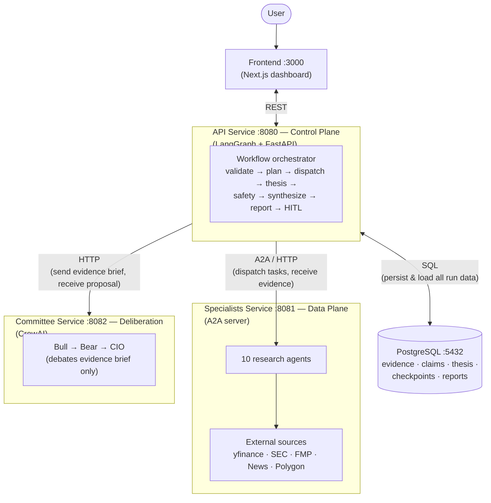
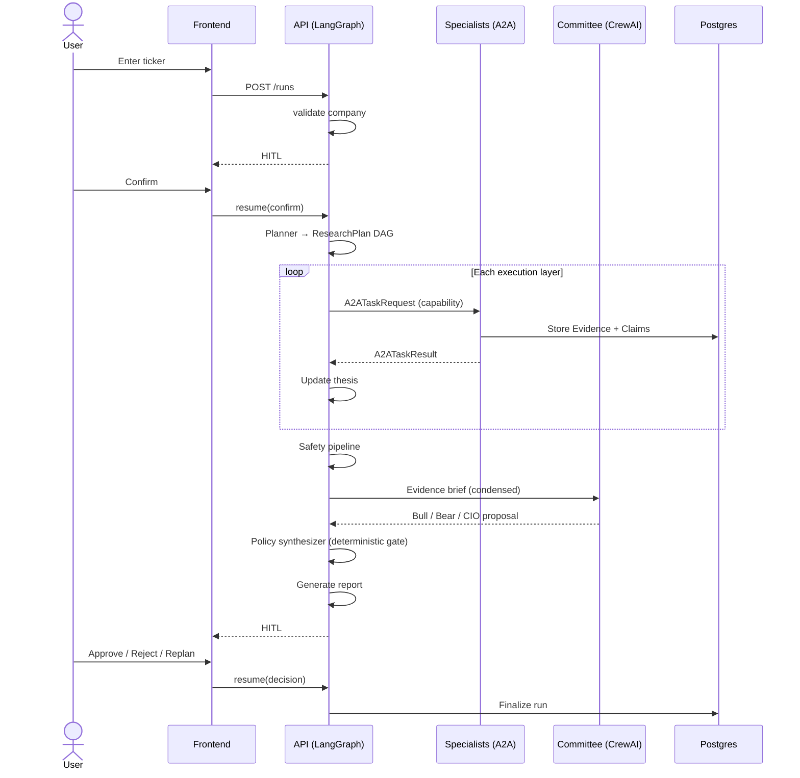
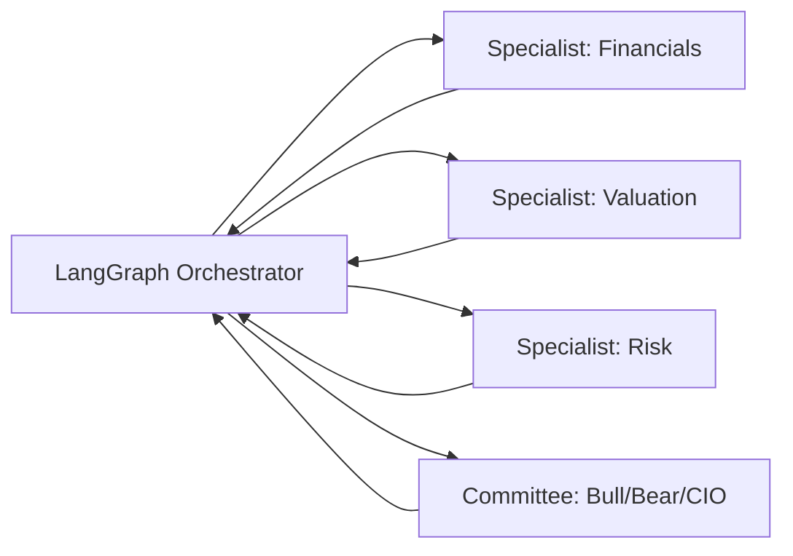

# Investment Research Platform — Architecture Document

*Research a public company the way an investment firm would—using a team of AI analysts that work together, verify their findings, and keep you involved in the final decision.*

**Author:** Sonia Mann 
**Course:** UCLA Extension — Agentic AI & Autonomous Systems (Capstone)  
**Repository:** https://github.com/soniamannlehl-cloud/finalproject

> ⚠️ **Academic capstone project.** This project was built as part of UCLA Extension's Agentic AI & Autonomous Systems course. It is for educational purposes only and is not investment advice.

---

## Why I Built It

Researching a company before investing isn't simple.

Professional investors don't make decisions based on one financial ratio or one news article. They gather information from many different sources, understand the company's industry, evaluate its financial performance, identify risks, compare competitors, and build an investment thesis before making a recommendation.

I wanted to see if a team of AI agents could work together the same way a professional investment research team does.

Instead of asking one AI assistant to do everything, I built a system where specialized AI agents each have a specific job and collaborate to produce a research report supported by evidence.

---

## What The Platform Does

Enter the name or ticker symbol of a public company. The platform then:

1. **Confirms you selected the correct company** (Checkpoint #1 — before any research spend)
2. **Creates a research plan** based on the company's industry
3. **Assigns research tasks** to specialized AI analysts
4. **Collects information** from financial data, SEC filings, earnings reports, news, and other trusted sources
5. **Builds an investment thesis** as new evidence is collected
6. **Holds an AI investment committee discussion** with both bullish and bearish viewpoints
7. **Generates a complete investment research report**
8. **Waits for your approval** before finalizing the recommendation (Checkpoint #2)

If there isn't enough evidence, the platform doesn't guess. Instead, it returns **Insufficient Evidence** and tells you that more research is needed.

The sections below describe how this works technically: system design, agent roles, framework choices, data flow, and the design tradeoffs I made along the way.

---

## 1. System design

At a high level, the **Investment Research Platform** mirrors a research desk workflow. A user enters a ticker; the platform plans industry-specific research, dispatches specialist agents to gather cited evidence, maintains a versioned investment thesis, runs safety checks, convenes an adversarial investment committee, generates a structured report, and requires human approval before any recommendation is finalized.

### Design commitments

These three principles guided every architectural decision:

1. **Nothing is asserted without evidence** — every claim must cite stored evidence IDs (enforced in code and the database).
2. **The platform may refuse to opiniate** — when evidence is too weak, the answer is *more research needed*, not a confident guess.
3. **You hold the final gate** — two human checkpoints; you can approve, reject, or request additional analysis before anything is finalized.

### Runtime topology

Four deployable components communicate over HTTP. Three Python services use
**different agent frameworks** on purpose; a shared `packages/contracts`
library (Pydantic only) is the integration seam.

| Component | Port | Technology | Responsibility |
|-----------|------|------------|----------------|
| Frontend | 3000 | Next.js | Dashboard, HITL approval UI |
| API (control plane) | 8080 | LangGraph + FastAPI | Workflow, planning, safety, reports |
| Specialists (data plane) | 8081 | A2A + FastAPI | 10 research agents, external APIs |
| Committee (deliberation) | 8082 | CrewAI + FastAPI | Bull / Bear / CIO debate |
| Postgres | 5432 | PostgreSQL | Evidence, thesis history, checkpoints |

**Core invariant:** the control plane *decides*, the data plane *retrieves*, the
committee *argues*. The API service never calls Yahoo Finance; specialists
never choose what to research next.

---

## 2. Architecture diagram

### Figure 1 — System architecture (service topology)

This diagram shows **how the deployable services connect**. The frontend talks
only to the API. The API orchestrates everything, calls specialists and
committee over HTTP, and is the **only** service that reads/writes Postgres.



**What this diagram intentionally omits:** internal LangGraph node names and
the research loop (director dispatches parallel tasks layer-by-layer until the
plan is complete). That detail is in Figure 2 (sequence) and Figure 4 (graph).

**Common misreadings to avoid:**

| Incorrect | Actual behavior |
|-----------|-----------------|
| Frontend calls specialists or committee directly | Frontend calls **API only** |
| Specialists write to Postgres | Specialists return evidence over A2A; **API persists** to Postgres |
| Safety pipeline calls the committee | **Committee node** in the API runs after safety completes |
| Synthesizer / report live in the committee service | Both run **inside the API** after the committee returns its proposal |

### Figure 2 — End-to-end data flow



### Figure 3 — Research workflow (ASCII)

This matches the flow described in the README — from ticker entry to your final review:

```
You enter a company or ticker
          │
          ▼
Confirm the correct company          ◆ Checkpoint #1
          │
          ▼
Create a research plan (industry-specific)
          │
          ▼
Specialized AI analysts research the company  (parallel)
          │
          ▼
Evidence is collected → Investment thesis is built
          │
          ▼
Safety checks → AI Investment Committee (Bull / Bear / CIO)
          │
          ▼
Research report generated
          │
          ▼
You review the final recommendation  ◆ Checkpoint #2
          │
          ▼
Approved investment research report
```

### Figure 4 — LangGraph workflow (technical detail)

```
START → validate → ◆ HITL #1 → planner → director
              ↓                      ↑
         specialist_proxy × N  (parallel A2A via Send API)
              ↓
           collect → thesis → (loop until plan complete)
              ↓
         safety → committee → synthesizer → report → ◆ HITL #2
              │                                         │
              │              approve/reject ────────────┴→ END
              └──── replan (capped) ───────────────────→ planner
```

The graph topology is **static**; dynamic behavior comes from the
`ResearchPlan` in state and LangGraph's `Send` API for parallel dispatch.
This preserves checkpoint compatibility across HITL pauses.

---

## 3. Agent roles

The platform uses **15+ distinct agent roles** across three layers — a team of specialists, not one general-purpose assistant.

### Control plane (API service)

| Agent / Node | Role | Does not |
|--------------|------|----------|
| **Company Validation** | Resolve ticker; classify public / private / unknown | Fetch financials |
| **Research Planner** | Select industry profile; emit `ResearchPlan` task DAG | Execute research |
| **Research Director** | Discover agents via A2A; dispatch, retry, merge results | Perform analysis |
| **Thesis Agent** | Versioned living thesis + structured analyst framework | Invent facts |
| **Safety Pipeline** | Coverage, citations, freshness, contradiction checks | Rewrite content |
| **Synthesizer** | Apply deterministic policy gate to committee output | Override rules with LLM |
| **Report Generator** | HTML/PDF report with resolved citations | Add uncited claims |

### Data plane — 10 specialist agents (11 capabilities)

| Agent | Capability(ies) | Output |
|-------|-----------------|--------|
| Company Validation | `company.validate` | Resolved ticker or structured failure |
| Company Profile | `company.profile` | Sector, industry, business summary |
| Financial Analyst | `financials.statements`, `financials.ratios` | Statements + **Python-computed** metrics |
| Valuation Analyst | `valuation.estimate` | Peer-relative valuation range |
| Risk Analyst | `risk.analysis` | Threshold-based risks from profile rules |
| Investment Driver | `investment.drivers` | KPI assessment vs profile drivers |
| Competitor Analyst | `competitors.analysis` | Percentile rank vs peers |
| News Analyst | `news.sentiment` | Sentiment tone + coverage count |
| SEC Filings | `filings.sec` | Material EDGAR filings |
| Earnings Analyst | `earnings.call` | Beat/miss history |

Specialists **never call each other**. Dependencies (e.g., valuation depends
on financials) are declared in the plan and enforced by the Director.

### Deliberation plane — investment committee (CrewAI)

| Agent | Role |
|-------|------|
| **Bull Analyst** | Strongest evidence-based case *for* investing |
| **Bear Analyst** | Strongest evidence-based case *against* investing |
| **CIO** | Weighs both sides; proposes buy / hold / sell / insufficient_evidence |

The committee receives a **capped evidence brief** only — it cannot fetch new
data or cite facts outside the brief.

---

## 4. Framework justification

The capstone requires at least **two** course frameworks. This project uses **three**.

| Course framework | Where | Why this framework |
|------------------|-------|-------------------|
| **LangGraph + HITL** | `services/api/` | Workflow has two human checkpoints that must survive days-long pauses. `interrupt()` + Postgres checkpointing is the right primitive; a CrewAI crew cannot pause mid-debate and resume after a user clicks "Confirm." |
| **A2A Protocol** | `services/specialists/` | Specialists are separately deployed services advertising capabilities via AgentCards. The Director discovers and routes at runtime — not hardcoded imports. This makes multi-agent communication a real network protocol. |
| **CrewAI** | `services/committee/` | Bull/Bear/CIO adversarial role-play is CrewAI's strength. The committee is bounded, stateless, and has no HITL — none of LangGraph's advantages apply inside it. |

### Google ADK — evaluated and rejected

ADK was considered for specialist agents. Specialists are **retrieval-and-compute
workloads**, not open-ended reasoners:

```
fetch → normalize → compute metrics (Python) → attach citations → one LLM interpretation
```

Financial ratios are computed deterministically because LLM arithmetic is unreliable.
Wrapping this in a full agent runtime would add a fourth dependency tree and duplicate
orchestration the control plane already owns. Specialists sit behind A2A, so a future
ADK swap would only change what runs behind an endpoint.

### Why three services (not one monolith)

A dependency-isolation experiment showed LangGraph and CrewAI *can* install together,
but the split is still justified by:

1. **Genuine A2A semantics** — separate addressable agents, not decorated function calls.
2. **Image size** — API ~530 MB vs committee ~1.8 GB; merging would slow every rebuild.
3. **Blast radius** — a CrewAI failure cannot kill in-flight checkpointed workflows.

---

## 5. Data flow

### Planning artifact

The Planner emits a `ResearchPlan`: a validated DAG of `TaskSpec` objects. Each
task names a **capability** (not an agent ID). Industry profiles (`packages/contracts/industry_profiles/`)
configure which capabilities, metrics, and valuation methods apply — e.g., banks
get ROE/NIM; REITs get FFO/NAV.

### Evidence and state

| Stored in LangGraph state (checkpointed) | Stored in Postgres (referenced by ID) |
|------------------------------------------|---------------------------------------|
| ticker, plan, task_status, scores | evidence payloads, claims |
| evidence_ids (list) | thesis version history |
| HITL decisions | reports, tool-call log |

Large payloads (filings, metrics) stay in Postgres so checkpoints remain small
and HITL resume stays fast.

### External data sources (6+)

| Source | Data | Fallback |
|--------|------|----------|
| Yahoo Finance (yfinance) | Quotes, statements | — (keyless anchor) |
| FMP | Financial statements | yfinance |
| SEC EDGAR | Filings | FMP |
| NewsAPI | Company news | Tavily |
| Tavily | Web search | — |
| Polygon / Massive | Market quotes | yfinance |

Missing providers degrade gracefully: evidence confidence drops, gaps are **declared in the report**.

### Guardrails (summary)

```
L0 Schema       — Claim requires ≥1 evidence_id (Pydantic + SQL)
L1 Deterministic — freshness, citation resolution, coverage scoring
L2 Semantic     — contradiction / hallucination detection (LLM)
L3 Policy       — recommendation gating (deterministic; overrides committee)
L4 Human        — HITL #2
```

The committee **proposes**; the synthesizer and policy gate **dispose**.

---

## 6. Key design decisions

| Decision | Rationale | Tradeoff |
|----------|-----------|----------|
| Static graph + dynamic `Send` dispatch | Checkpoint-stable topology; parallel specialist fan-out | Planner does not literally rebuild the graph |
| Capability-based routing | Planner decoupled from agent identity | New specialist = register AgentCard, not graph edit |
| Deterministic financial math | Eliminates arithmetic hallucination | Less "agentic" than LLM-computed ratios |
| Condensed committee brief | Cost control + prevents off-brief citations | Committee cannot use evidence not in brief |
| Capped retries / replans | Prevents runaway loops in demo and production | May stop before full convergence |
| `packages/contracts` shared package | Framework-neutral schemas across 3 services | Extra package to maintain |
| Model tiering (mini vs gpt-4o) | Cost control on high-volume calls | Two tiers to tune |

---

# Technical Analysis

This section connects my implementation to course concepts in multi-agent systems: which planning paradigm I used and why, how my coordination model compares to alternatives, and what the platform's limitations are.

---

## 7. Planning paradigm: hierarchical decomposition with monitored replanning

### What I chose

The platform combines **three planning styles**, each matched to the uncertainty of the task:

**1. Fixed workflows for specialists (not ReAct loops)**  
Each specialist follows a predefined code path: call provider → normalize →
compute → optionally interpret. ReAct-style tool selection was rejected because
the data sources and steps are known in advance. Letting an LLM dynamically
choose tools adds non-determinism without benefit — a dynamic agent can skip
SEC filings or stop early. This follows the course distinction between
**workflows** (known structure) and **agents** (open-ended autonomy).

**2. Explicit hierarchical decomposition at the Planner**  
The Planner performs top-down task decomposition, emitting a `ResearchPlan`
whose structure varies by **industry profile**. Decomposition is a **data artifact**
(loggable, diffable, testable, visible in the UI) — not an implicit chain of
prompts. This is explicit planning: the plan is inspectable before execution starts.

**3. Monitor-and-revise replanning at HITL #2**  
When the human requests more analysis, the Planner emits a new plan *revision*
(with `parent_revision` and `replan_reason`). The Director diffs against completed
work and dispatches only the **delta**. This is monitored replanning: the system
does not patch outputs in place; it revises the plan and re-executes affected tasks.

### Why not pure ReAct or pure pipeline?

| Approach | Why not used here |
|----------|-------------------|
| **Pure ReAct** (single agent, dynamic tools) | No industry-aware structure; hard to enforce evidence citations; unpredictable cost |
| **Pure fixed pipeline** (same steps every ticker) | Banks and REITs need different metrics and valuation methods |
| **LLM-only planning** (no validated DAG) | Cycles and orphan dependencies cause mid-run hangs; we validate the DAG at construction |

Our hybrid — **explicit plan artifact + fixed specialist workflows + capped replan** —
balances adaptability with auditability. That matters for a platform that must
explain *why* it researched what it researched.

---

## 8. Coordination model: orchestrator–worker with capability routing

### What I chose

The dominant pattern is **hub-and-spoke orchestration**: a LangGraph state machine coordinates all stages. The Director dispatches work to specialist analysts via A2A; the committee handles deliberation as a separate step.



### Comparison to alternatives

| Coordination model | Description | Fit for this project |
|--------------------|-------------|----------------------|
| **Orchestrator–worker** (chosen) | Central controller assigns tasks with known dependencies | ✅ Dependencies are known (valuation needs financials); graph is debuggable; every transition is enumerable in `builder.py` |
| **Autonomous conversation** (AutoGen group chat, CrewAI delegation) | Agents negotiate turn order and delegate freely | ❌ Research dependencies are fixed, not emergent; conversation hides structure; hard to retry one failed step |
| **Blackboard** | Agents read/write shared memory opportunistically | ⚠️ Partial — Postgres evidence store resembles a blackboard, but routing is **not** opportunistic; the Director assigns work explicitly |
| **Market-based / auction** | Agents bid on tasks | ❌ Over-engineered for 10 known specialists with fixed capabilities |

**Where A2A adds peer-style coordination:** the Director routes by **capability
match** at runtime (discovered from AgentCards), not by hardcoded agent IDs.
This is the one place routing resembles capability-based peer dispatch rather
than fixed graph edges — and it is why A2A earns a separate service boundary.

**Where CrewAI differs:** inside the committee, Bull → Bear → CIO is sequential
role-play with context handoff — a small conversational subgraph, deliberately
bounded (no delegation, no memory, `max_iter=2`).

### Tool-use pattern

Numeric results (ratios, scores, thresholds) are computed in **Python**.
The LLM interprets pre-computed values; it does not calculate them. Alternatives
rejected:

- **LLM arithmetic** — unreliable (negative-EPS P/E, rounding errors).
- **Code interpreter agent** — flexible but harder to audit for a fixed formula set.

This is a deliberate **workflow-over-agent** choice at the data layer.

---

## 9. Limitations

| Limitation | Impact |
|------------|--------|
| **Bounded industry profiles** | Companies outside 13 profiles fall back to generic analysis — less precise metrics |
| **No cross-session learning** | Each run is independent; the platform does not improve from past approvals |
| **Startup-cached A2A discovery** | A specialist deployed mid-run is not discovered until refresh |
| **Semantic safety is LLM-judged** | Contradiction/hallucination checks inherit model failure modes; deterministic layers are the real floor |
| **Committee cost** | Three LLM agents dominate per-run token spend despite brief capping |
| **Local-only deployment** | Runs on Docker locally; no hosted demo URL without additional deployment work |
| **No per-run budget cap** | Retries and replans are capped, but token/$ spend per run is not hard-limited |
| **Single-instance architecture** | No queue-backed dispatch; specialist restart mid-run fails tasks into retry path |

### What I would do next

- Publish `packages/contracts` as a standalone open-source package others can reuse.
- Add queue-backed agent dispatch for resilience at scale.
- Expand industry profile coverage and per-run cost controls.
- Deploy a hosted demo environment so reviewers can access the UI without running Docker locally.

---

## 10. Course frameworks summary

This capstone required at least **two** of five course frameworks. I used **three**:

| Framework | Used? | Where in the codebase |
|-----------|-------|------------------------|
| LangGraph + HITL | ✅ Yes | 2 human checkpoints, Postgres checkpointing — `services/api/app/graph/` |
| A2A Protocol | ✅ Yes | AgentCards, capability routing — `services/specialists/app/a2a/` |
| CrewAI | ✅ Yes | Bull / Bear / CIO debate — `services/committee/app/crew/` |
| Google ADK | ❌ No | Evaluated; rejected — see §4 |
| n8n | ❌ No | Not needed — three frameworks already satisfy the requirement |

**Scope delivered:** 15+ agent roles · explicit research plan · 6+ data sources ·
2 human approval checkpoints · layered guardrails · Docker Compose deployment ·
automated evaluation harness (`evaluation/run_consistency.py`).

---

*Document version: capstone submission · diagrams render in GitHub Markdown and export cleanly to PDF via any Markdown-to-PDF tool (no images required).*
