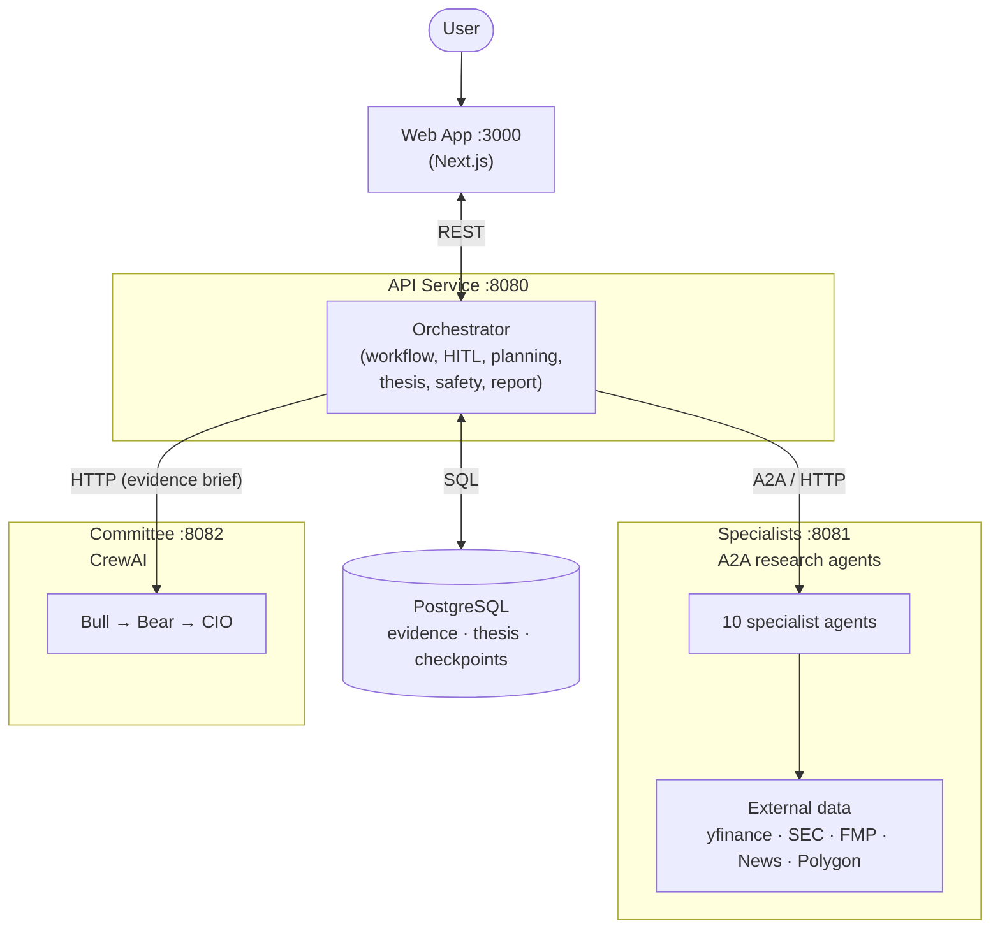
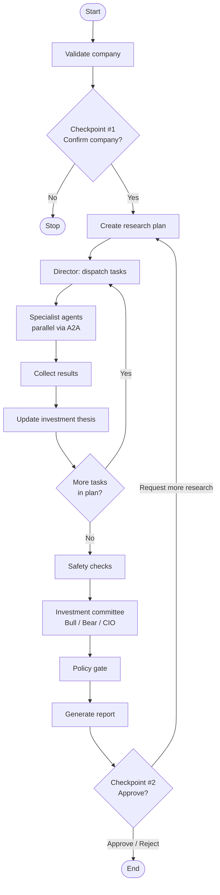
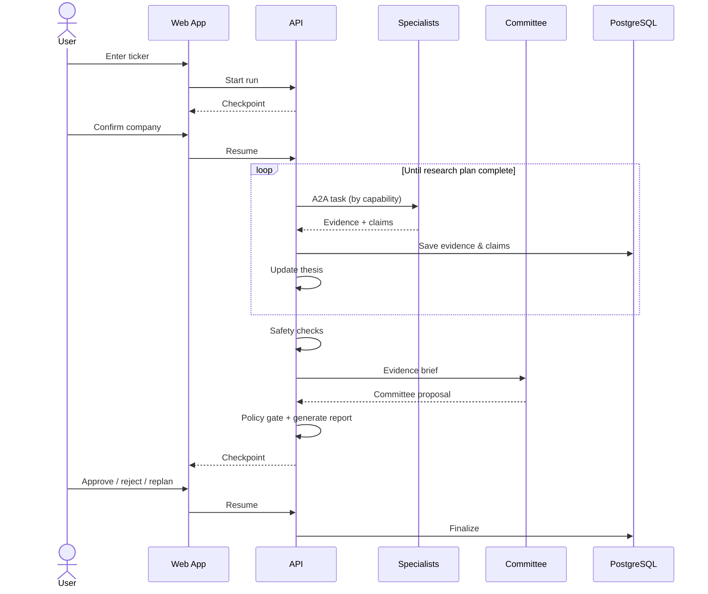
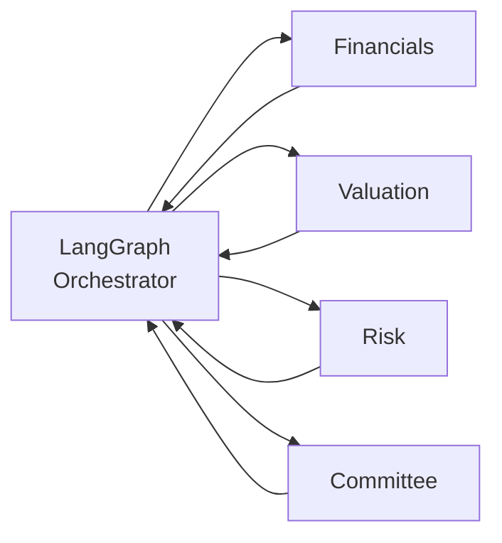

# Investment Research Platform — Architecture Document

**Author:** Sonia Mannlehl  
**Course:** UCLA Extension — Agentic AI & Autonomous Systems (Capstone)  
**Repository:** https://github.com/soniamannlehl-cloud/finalproject

> ⚠️ Academic capstone project. Built for educational purposes only. Not investment advice.

---

# Part I — Architecture Document

## 1. System Design

The **Investment Research Platform** simulates a professional investment research desk. A user enters a public company ticker; the system plans industry-specific research, assigns work to specialized AI analysts, collects cited evidence, builds a living investment thesis, runs safety checks, convenes a Bull/Bear/CIO investment committee, generates a report, and requires human approval before finalizing any recommendation.

### Design principles

| Principle | Implementation |
|-----------|----------------|
| **Evidence-first** | Every claim must cite stored evidence IDs (enforced in Pydantic models and PostgreSQL). |
| **Refuse to guess** | When evidence is insufficient, the platform returns *Insufficient Evidence* — not a forced Buy/Sell. |
| **Human-in-the-loop** | Two approval checkpoints: confirm the company before research spend; review the full report before finalize. |

### Components

The platform runs as **four deployable services** plus a database. Three Python backends use different agent frameworks; a shared `packages/contracts` library (Pydantic only) defines common schemas.

| Component | Port | Technology | Role |
|-----------|------|------------|------|
| Web application | 3000 | Next.js | User dashboard and approval UI |
| API service (control plane) | 8080 | LangGraph + FastAPI | Workflow, planning, safety, reports |
| Specialists service (data plane) | 8081 | A2A + FastAPI | 10 research agents, external APIs |
| Committee service (deliberation) | 8082 | CrewAI + FastAPI | Bull / Bear / CIO debate |
| PostgreSQL | 5432 | PostgreSQL | Evidence, thesis, checkpoints, reports |

**Architectural invariant:** the control plane *decides*, the data plane *retrieves*, the committee *argues*. The API never calls market-data APIs directly; specialists never decide what to research next.

---

## 2. Architecture Diagram

### Diagram 1 — System architecture (required)

Shows how services connect at deployment time. The web app talks **only** to the API. The API is the **only** component that reads/writes PostgreSQL.

### Diagram 2 — Research workflow (LangGraph)

Shows the **order of stages** inside the API orchestrator. Research tasks run in a loop until the plan is complete; then safety, committee, and report run once.

---

## 3. Agent Roles

The platform implements **15+ agent roles** across three layers.

### Orchestration agents (API service)

| Agent | Responsibility |
|-------|----------------|
| Company Validation | Resolve ticker; detect private or unknown companies |
| Research Planner | Select industry profile; build research plan (task DAG) |
| Research Director | Discover agents via A2A; dispatch, retry, merge results |
| Thesis Agent | Maintain versioned investment thesis as evidence arrives |
| Safety Pipeline | Check coverage, citations, freshness, contradictions |
| Synthesizer | Apply deterministic policy rules to committee output |
| Report Generator | Produce HTML/PDF report with resolved citations |

### Research specialist agents (10 agents, 11 capabilities)

| Agent | Research area |
|-------|---------------|
| Company Validation | Ticker resolution |
| Company Profile | Sector, industry, business description |
| Financial Analyst | Financial statements and ratios (metrics computed in Python) |
| Valuation Analyst | Peer-relative valuation |
| Risk Analyst | Industry-aware risk flags |
| Investment Driver | KPI and driver assessment |
| Competitor Analyst | Peer comparison |
| News Analyst | News sentiment |
| SEC Filings | EDGAR filings |
| Earnings Analyst | Earnings beat/miss history |

Specialists do not call each other. Task dependencies (e.g., valuation after financials) are declared in the research plan and enforced by the Director.

### Investment committee (CrewAI)

| Agent | Role |
|-------|------|
| Bull Analyst | Strongest case *for* investing |
| Bear Analyst | Strongest case *against* investing |
| CIO | Final proposal: buy / hold / sell / insufficient evidence |

The committee debates only from a **condensed evidence brief** — it cannot fetch new data.

---

## 4. Framework Justification

The capstone requires at least **two** course frameworks. This project uses **three**.

| Framework | Location | Why I chose it |
|-----------|----------|----------------|
| **LangGraph + HITL** | `services/api/` | The workflow has two human checkpoints that must pause and resume across separate HTTP requests. LangGraph `interrupt()` with Postgres checkpointing supports this; CrewAI cannot pause mid-debate and resume days later. |
| **A2A Protocol** | `services/specialists/` | Research agents are separately deployed services that advertise capabilities via AgentCards. The Director discovers and routes at runtime — multi-agent communication is a real network protocol, not in-process function calls. |
| **CrewAI** | `services/committee/` | Bull/Bear/CIO adversarial role-play is CrewAI's strength. The committee is bounded and stateless — no checkpointing or HITL needed inside it. |

**Google ADK — evaluated, not used.** Specialist agents are retrieval-and-compute workloads (fetch data → compute metrics in Python → one LLM interpretation). A full agent runtime would duplicate orchestration the API already owns. Specialists sit behind A2A, so the runtime could be swapped later without changing the workflow.

**Why three services instead of one monolith:** (1) genuine A2A semantics across containers, (2) smaller control-plane Docker image (~530 MB vs ~1.8 GB for committee), (3) blast-radius isolation — a committee failure does not crash in-flight workflows.

---

## 5. Data Flow

### End-to-end path

1. **User → Web app → API** — start run, confirm checkpoints, approve or reject.
2. **Planner** — selects an industry profile (13 frameworks) and emits a validated `ResearchPlan` (task DAG).
3. **Director** — for each plan layer, dispatches parallel A2A tasks to specialist agents by **capability** (not agent name).
4. **Specialists** — call external APIs, compute metrics deterministically, return evidence and claims in the A2A response.
5. **API persists** — evidence and claims are saved to PostgreSQL; LangGraph state stores only IDs.
6. **Thesis agent** — updates after each research batch (living thesis, not a one-time summary).
7. **Safety pipeline** — deterministic checks first, then semantic contradiction/hallucination checks.
8. **Committee** — API sends a condensed brief; committee returns a proposal over HTTP.
9. **Synthesizer** — deterministic policy gate may downgrade or block the recommendation.
10. **Report generator** — builds the report; **Checkpoint #2** presents it to the user.

### Sequence view

### External data sources (6+)

Yahoo Finance (keyless fallback), FMP, SEC EDGAR, NewsAPI, Tavily, Polygon/Massive. Missing providers degrade gracefully — gaps appear in the report, not hidden failures.

---

## 6. Key Design Decisions

| Decision | Why | Tradeoff |
|----------|-----|----------|
| Static workflow graph + dynamic task dispatch | Checkpoint-stable; parallel research via LangGraph `Send` | Graph topology does not change per company |
| Capability-based agent routing | Planner independent of agent implementation | Must register new agents in A2A catalog |
| Python-computed financial metrics | Prevents LLM arithmetic errors | Less flexible than LLM-computed numbers |
| Capped evidence brief for committee | Controls cost; committee cannot cite off-brief facts | Committee sees a summary, not raw filings |
| API-only database access | Single persistence layer; specialists stay stateless | All evidence flows through the control plane |
| Deterministic policy gate after committee | LLM cannot override insufficient evidence | May block a confident-sounding committee call |
| Bounded retries and replans | Prevents runaway loops and cost spikes | May stop before fully converging |

---

# Part II — Technical Analysis

*Critical reflection connecting this implementation to course concepts in multi-agent systems.*

---

## 7. Planning Paradigm

### What I used: hierarchical decomposition with monitored replanning

I matched planning style to how much uncertainty exists at each layer:

**Specialists — fixed workflows (not ReAct).** Each analyst follows a known path: fetch → normalize → compute → interpret. ReAct-style dynamic tool selection was rejected because research steps are known in advance. A dynamic agent can skip filings or stop early; a workflow cannot.

**Planner — explicit hierarchical decomposition.** The Planner emits a `ResearchPlan` — a validated task DAG whose tasks, metrics, and valuation methods vary by **industry profile** (banks vs REITs vs tech). The plan is a data artifact: visible in the UI, testable, and diffable when replanning occurs. This is explicit planning, not a hardcoded pipeline or an implicit prompt chain.

**HITL #2 — monitor-and-revise replanning.** When the user requests more analysis, the Planner creates a new plan revision. The Director dispatches only tasks that were not already completed. The thesis is rebuilt from new evidence rather than patched in place.

### Why not alternatives?

| Paradigm | Why not used |
|----------|--------------|
| Pure ReAct (one agent, dynamic tools) | No industry-specific structure; hard to enforce citations; unpredictable cost |
| Pure fixed pipeline (same steps every company) | A bank and a REIT require different metrics and valuation methods |
| LLM-only planning (no DAG validation) | Invalid dependencies cause mid-run hangs; DAG is validated at construction |

---

## 8. Coordination Model

### What I used: orchestrator–worker with capability routing

A **LangGraph state machine** (hub) coordinates all stages. The Director assigns tasks to specialist workers via A2A. The committee is a separate worker invoked once research and safety are complete.

### Comparison to course alternatives

| Model | Description | Assessment |
|-------|-------------|------------|
| **Orchestrator–worker** *(chosen)* | Central controller assigns tasks with known dependencies | Best fit — valuation depends on financials; every transition is explicit in `graph/builder.py` |
| **Autonomous conversation** (AutoGen, CrewAI delegation) | Agents negotiate order and delegate freely | Rejected — dependencies are fixed; conversation hides structure; hard to retry one failed task |
| **Blackboard** | Agents read/write shared memory opportunistically | Partial — Postgres stores evidence, but the Director assigns work explicitly; routing is not opportunistic |
| **Peer / market-based** | Agents bid for tasks | Rejected — over-engineered for 10 known specialists |

**A2A's role:** the Director routes by **capability match** at runtime (from AgentCards), not hardcoded agent IDs. That is capability-based dispatch within an orchestrator–worker pattern.

**CrewAI's role:** limited to the committee subgraph — sequential Bull → Bear → CIO debate with no delegation and no cross-run memory.

**Tool-use pattern:** numbers are computed in Python; the LLM interprets results. LLM arithmetic and code-interpreter patterns were rejected as unreliable or hard to audit for financial ratios.

---

## 9. Limitations

| Limitation | Consequence |
|------------|-------------|
| Bounded industry profiles (13) | Unmatched companies get generic analysis |
| No cross-session learning | Each run is independent |
| Semantic safety is LLM-judged | Contradiction detection inherits model weaknesses; deterministic checks are the floor |
| Committee is the main cost driver | Three LLM agents per run despite brief capping |
| Local Docker deployment | Reviewers must run locally or watch a screen recording |
| No per-run token budget | Retries/replans are capped, but total spend is not |
| Single-instance services | No queue-backed dispatch; mid-run specialist restart relies on retry logic |

### Future work

Expand industry profiles, add per-run cost controls, publish the shared contracts package as a standalone library, and deploy a hosted demo URL for reviewers.

---

*Export tip: open this file on GitHub or in any Markdown editor → Print → Save as PDF. Diagrams are Mermaid (no image files required).*
