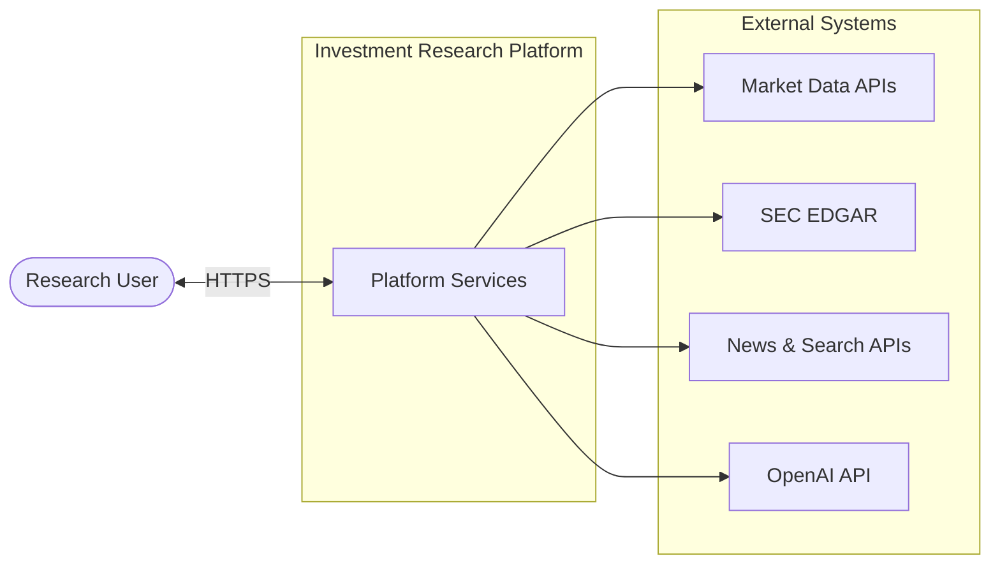
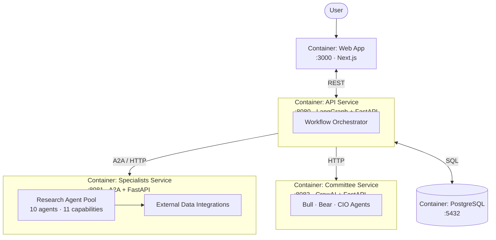
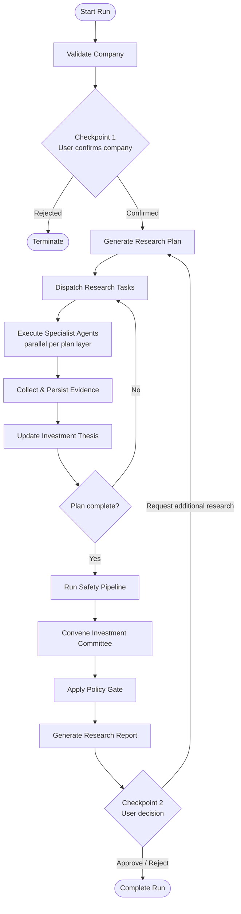
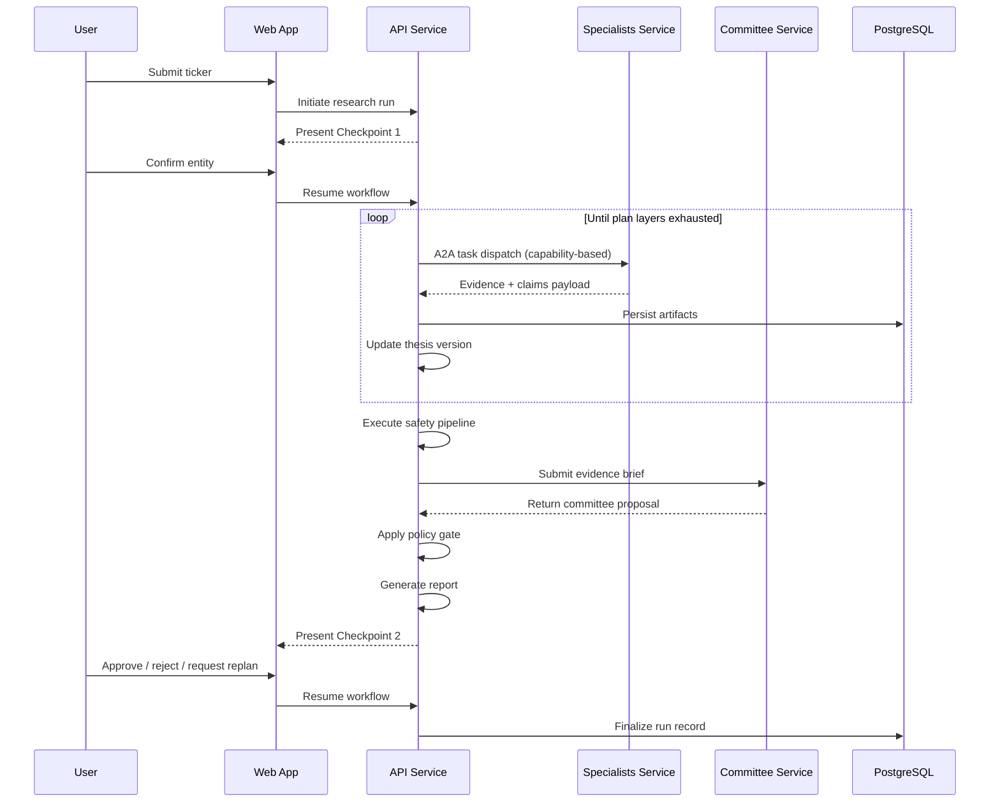

# Investment Research Platform
## Solution Architecture Document

| | |
|---|---|
| **Document type** | Solution Architecture |
| **Version** | 1.0 |
| **Author** | Sonia Mannlehl |
| **Course** | UCLA Extension — Agentic AI & Autonomous Systems (Capstone) |
| **Repository** | https://github.com/soniamannlehl-cloud/finalproject |
| **Status** | Final |

> **Disclaimer:** Academic capstone deliverable. For educational purposes only. Not investment advice.

---

## 1. Executive Summary

The Investment Research Platform is a multi-agent solution that automates structured equity research for publicly traded companies. The platform emulates a professional research desk: it plans industry-aware analysis, delegates work to specialized agents, aggregates verifiable evidence, evaluates findings through safety controls and an adversarial investment committee, and produces a cited research report subject to human approval.

The solution is implemented as a **containerized, multi-service architecture** comprising a web channel, an orchestration tier, a research execution tier, a deliberation tier, and a persistence tier. Three course-mandated agent frameworks—**LangGraph (HITL)**, **A2A**, and **CrewAI**—each own a distinct concern within the overall design.

---

## 2. Business Context & Scope

### 2.1 Problem statement

Investment research requires synthesizing heterogeneous sources—financial statements, regulatory filings, market data, news, peer comparisons, and risk indicators—into a defensible recommendation. Single-model chat approaches lack structured planning, evidence traceability, role separation, and governed human approval suitable for high-stakes analytical workflows.

### 2.2 Solution objectives

| Objective | Description |
|-----------|-------------|
| **Structured research** | Generate an explicit, industry-aware research plan before execution. |
| **Evidence traceability** | Bind every analytical claim to retrievable evidence artifacts. |
| **Controlled autonomy** | Automate research execution while retaining human gates at defined checkpoints. |
| **Adversarial review** | Subject conclusions to explicit bull/bear deliberation prior to recommendation. |
| **Fail-safe behavior** | Withhold directional guidance when evidence quality is insufficient. |

### 2.3 Out of scope

- Live trading or portfolio execution
- Cross-session learning or model fine-tuning from user feedback
- Hosted multi-tenant production deployment (current state: local Docker deployment)

---

## 3. Architecture Principles

The following principles constrain all design decisions:

1. **Separation of concerns** — Planning, retrieval, deliberation, and persistence are assigned to distinct runtime boundaries.
2. **Evidence before assertion** — No analytical claim may exist without at least one resolvable evidence reference.
3. **Deterministic governance over probabilistic judgment** — Policy rules govern final recommendation eligibility; LLM output alone cannot authorize a directional call.
4. **Human authority at defined checkpoints** — Automation pauses for explicit user confirmation and final approval.
5. **Graceful degradation** — Missing data providers reduce coverage and are disclosed; they do not abort the workflow.
6. **Bounded automation** — Retries, replans, and agent iterations are capped to prevent unbounded cost and runtime.

---

## 4. Solution Overview

### 4.1 Capability map

| Capability | Primary owner |
|------------|---------------|
| User interaction & HITL presentation | Web application (Next.js) |
| Workflow orchestration & checkpointing | API service (LangGraph) |
| Research planning & task dispatch | API service |
| Specialist research execution | Specialists service (A2A) |
| Investment committee deliberation | Committee service (CrewAI) |
| Evidence & report persistence | PostgreSQL (via API service) |
| Shared domain contracts | `packages/contracts` (Pydantic) |

### 4.2 Logical architecture

The solution adheres to a **three-plane model**:

| Plane | Responsibility | Must not |
|-------|----------------|----------|
| **Control plane** | Decide what to research, when, and in what order | Call external data providers directly |
| **Data plane** | Retrieve, normalize, and compute research artifacts | Determine research scope or store persistent state |
| **Deliberation plane** | Debate investment implications from supplied evidence | Fetch new data or persist outcomes |

---

## 5. Architecture Views

### 5.1 Context view

External actors and system boundary.

### 5.2 Container view (deployment architecture)

Primary architecture diagram. Defines deployable units and authorized communication paths.

**Integration rules enforced by this view:**

| From | To | Allowed | Notes |
|------|-----|---------|-------|
| Web App | API Service | ✅ | Sole client entry point |
| Web App | Specialists / Committee | ❌ | No direct access |
| API Service | Specialists | ✅ | Task dispatch via A2A |
| API Service | Committee | ✅ | Evidence brief in / proposal out |
| API Service | PostgreSQL | ✅ | Exclusive persistence owner |
| Specialists | PostgreSQL | ❌ | Stateless; returns payloads to API |
| Committee | PostgreSQL | ❌ | Stateless deliberation service |

### 5.3 Process view (orchestration workflow)

End-to-end process flow within the control plane.

---

## 6. Component Specification

### 6.1 Web application

| Attribute | Value |
|-----------|-------|
| **Technology** | Next.js, React, TypeScript, Tailwind CSS |
| **Port** | 3000 |
| **Responsibilities** | Run initiation, checkpoint presentation, evidence/thesis/report visualization, user decision capture |
| **Dependencies** | API service (REST) |

### 6.2 API service (control plane)

| Attribute | Value |
|-----------|-------|
| **Technology** | FastAPI, LangGraph, PostgreSQL checkpointer |
| **Port** | 8080 |
| **Responsibilities** | Workflow state machine, HITL interrupts, research planning, task orchestration, thesis management, safety enforcement, policy gating, report generation |
| **Dependencies** | Specialists service (A2A), Committee service (HTTP), PostgreSQL |

**Orchestration agents (logical components):**

| Component | Function |
|-----------|----------|
| Company Validation | Entity resolution and eligibility classification |
| Research Planner | Industry profile selection; `ResearchPlan` generation |
| Research Director | Capability-based dispatch, retry handling, result aggregation |
| Thesis Agent | Versioned investment thesis maintenance |
| Safety Pipeline | Coverage, citation, freshness, and semantic integrity checks |
| Synthesizer | Deterministic recommendation policy enforcement |
| Report Generator | Structured report rendering (HTML/PDF) |

### 6.3 Specialists service (data plane)

| Attribute | Value |
|-----------|-------|
| **Technology** | FastAPI, A2A protocol |
| **Port** | 8081 |
| **Responsibilities** | Execute domain-specific research tasks; integrate external data sources; return structured evidence |
| **Agent count** | 10 agents exposing 11 capabilities |

| Research domain | Agent | Capabilities |
|-----------------|-------|--------------|
| Entity resolution | Company Validation | `company.validate` |
| Company profile | Company Profile | `company.profile` |
| Financial analysis | Financial Analyst | `financials.statements`, `financials.ratios` |
| Valuation | Valuation Analyst | `valuation.estimate` |
| Risk | Risk Analyst | `risk.analysis` |
| Investment drivers | Investment Driver | `investment.drivers` |
| Peers | Competitor Analyst | `competitors.analysis` |
| News | News Analyst | `news.sentiment` |
| Regulatory | SEC Filings | `filings.sec` |
| Earnings | Earnings Analyst | `earnings.call` |

**Execution pattern:** fixed workflow per agent (fetch → normalize → deterministic computation → optional LLM interpretation). Financial metrics are computed in Python; LLMs do not perform arithmetic.

### 6.4 Committee service (deliberation plane)

| Attribute | Value |
|-----------|-------|
| **Technology** | FastAPI, CrewAI |
| **Port** | 8082 |
| **Responsibilities** | Adversarial review via Bull, Bear, and CIO personas |
| **Input** | Condensed evidence brief (size-capped) |
| **Output** | Structured committee proposal (action, confidence, rationale) |
| **Constraints** | No data retrieval; no persistence; no cross-run memory |

### 6.5 Persistence tier

| Attribute | Value |
|-----------|-------|
| **Technology** | PostgreSQL 16 |
| **Port** | 5432 |
| **Stored entities** | Evidence, claims, thesis versions, LangGraph checkpoints, reports, tool-call metadata |
| **Access pattern** | Read/write exclusively via API service |

### 6.6 Shared contracts module

| Attribute | Value |
|-----------|-------|
| **Package** | `packages/contracts` (`irp-contracts`) |
| **Technology** | Pydantic (framework-neutral) |
| **Purpose** | Canonical schemas for evidence, plans, thesis, safety, recommendations, and industry profiles across all services |

---

## 7. Framework Selection & Rationale

### 7.1 Course framework alignment

Minimum requirement: **two** frameworks. Implemented: **three**.

| Framework | Role in solution | Rationale |
|-----------|------------------|-----------|
| **LangGraph + HITL** | Workflow orchestration, checkpointing, human interrupts | Supports durable pause/resume at two approval gates across independent HTTP sessions. |
| **A2A Protocol** | Inter-service agent discovery and task dispatch | Enables independently deployable research agents with runtime capability routing. |
| **CrewAI** | Committee role-play deliberation | Optimal fit for bounded adversarial multi-persona debate without workflow state requirements. |

### 7.2 Evaluated alternatives

| Option | Decision | Rationale |
|--------|----------|-----------|
| **Google ADK** (specialist runtime) | Not adopted | Specialists are deterministic retrieval/compute pipelines; ADK would duplicate orchestration already owned by the control plane. |
| **n8n** | Not adopted | Not required; three agent frameworks already satisfy course requirements. |
| **Monolithic single service** | Not adopted | Would collapse A2A boundaries, inflate control-plane image size, and increase failure blast radius. |

---

## 8. Data Architecture & Flow

### 8.1 Research planning artifact

The Planner produces a **`ResearchPlan`**: a validated directed acyclic graph of `TaskSpec` entries. Each task references a **capability** (e.g., `financials.ratios`), not a concrete agent identity. Industry profiles (`packages/contracts/industry_profiles/`) parameterize metrics, valuation methods, and risk rules per sector.

### 8.2 State partitioning

| Concern | LangGraph checkpoint state | PostgreSQL |
|---------|---------------------------|------------|
| Workflow control | ticker, plan, task status, HITL decisions | — |
| Reference indexes | evidence ID lists, thesis version pointer | full evidence payloads, claims |
| Analytical outputs | safety flags, scores | thesis history, reports |

Large binary and textual payloads remain in PostgreSQL to minimize checkpoint size and optimize HITL resume latency.

### 8.3 End-to-end data flow

### 8.4 External data integrations

| Source | Domain | Fallback |
|--------|--------|----------|
| Yahoo Finance (yfinance) | Quotes, statements | Primary keyless anchor |
| Financial Modeling Prep | Statements | yfinance |
| SEC EDGAR | Regulatory filings | FMP |
| NewsAPI | Company news | Tavily |
| Tavily | Web search | — |
| Polygon / Massive | Market quotes | yfinance |

---

## 9. Non-Functional Design

### 9.1 Guardrail layers

| Layer | Mechanism | Type |
|-------|-----------|------|
| L0 | Schema enforcement — claims require evidence IDs | Deterministic |
| L1 | Coverage, citation resolution, data freshness | Deterministic |
| L2 | Contradiction and hallucination detection | LLM-assisted |
| L3 | Recommendation policy gate | Deterministic |
| L4 | Human approval (Checkpoint 2) | Human |

The committee proposes; the policy gate disposes. A high-confidence committee recommendation may still be blocked if evidence thresholds are not met.

### 9.2 Operational characteristics

| Attribute | Approach |
|-----------|----------|
| **Deployment** | Docker Compose; single-command startup |
| **Health monitoring** | Container health checks per service |
| **Observability** | LangSmith tracing with cross-service `traceparent` propagation |
| **Resilience** | Task retries, provider failover, declared-gap reporting |
| **Cost control** | Model tiering, capped brief size, bounded replan/retry limits |

---

## 10. Key Architecture Decisions

| ID | Decision | Drivers | Implications |
|----|----------|---------|--------------|
| AD-01 | Three-service decomposition | A2A semantics, image size, fault isolation | Network hop overhead; distributed tracing required |
| AD-02 | Static graph + dynamic dispatch | Checkpoint compatibility | Plan-driven parallelism via LangGraph `Send` API |
| AD-03 | Capability-based routing | Planner–agent decoupling | Agent registration via A2A AgentCards |
| AD-04 | API-exclusive persistence | Single source of truth | Specialists and committee remain stateless |
| AD-05 | Deterministic financial computation | Auditability, accuracy | Reduced LLM autonomy at data layer |
| AD-06 | Capped committee brief | Cost and citation control | Committee cannot reference off-brief evidence |
| AD-07 | Framework-neutral contracts package | Cross-service schema consistency | Additional module maintenance |

---

# Part II — Technical Analysis

## 11. Planning Paradigm

### 11.1 Selected approach

The solution implements **hierarchical task decomposition with monitored replanning**, applied at different layers according to task predictability:

| Layer | Paradigm | Justification |
|-------|----------|---------------|
| Specialist agents | **Fixed workflow** | Data sources and processing steps are known a priori; dynamic ReAct selection introduces avoidable non-determinism. |
| Research Planner | **Explicit hierarchical decomposition** | Industry-dependent research structure is emitted as a validated, inspectable `ResearchPlan` artifact. |
| HITL replan path | **Monitor-and-revise** | User-requested additional analysis triggers a new plan revision; only delta tasks are re-dispatched. |

### 11.2 Rejected paradigms

| Paradigm | Limitation in this domain |
|----------|---------------------------|
| Pure ReAct (single autonomous agent) | Insufficient structure for industry-specific analysis; weak citation enforcement; unbounded cost |
| Pure static pipeline | Cannot adapt metrics and valuation methods across industries |
| Unvalidated LLM-generated plans | Risk of cyclic dependencies and non-terminating execution |

---

## 12. Coordination Model

### 12.1 Selected model

**Orchestrator–worker with capability routing.** A central LangGraph state machine coordinates stage transitions. The Director dispatches work to specialist workers through A2A. The committee operates as an invoked deliberation worker upon completion of research and safety validation.

### 12.2 Comparative analysis

| Model | Description | Fit |
|-------|-------------|-----|
| **Orchestrator–worker** *(selected)* | Hub assigns tasks along known dependencies | ✅ Optimal — research DAG is predefined and auditable |
| **Autonomous conversation** | Agents negotiate execution order (e.g., AutoGen) | ❌ Poor — hides dependency structure; complicates retry semantics |
| **Blackboard** | Opportunistic shared-memory collaboration | ⚠️ Partial — evidence store resembles blackboard; routing remains explicit |
| **Market-based allocation** | Agents bid on tasks | ❌ Unnecessary complexity for fixed capability catalog |

A2A introduces **capability-based worker selection** within the orchestrator pattern: agents are discovered at runtime via AgentCards rather than hardcoded bindings.

---

## 13. Constraints, Risks & Limitations

| Category | Item | Impact | Mitigation (current / future) |
|----------|------|--------|-------------------------------|
| **Functional** | 13 industry profiles | Generic fallback for unmatched sectors | Expand profile library |
| **Functional** | No cross-run learning | Each session is independent | Future feedback loop (out of scope) |
| **Operational** | Local deployment only | Reviewers must run Docker locally | Planned hosted deployment |
| **Quality** | LLM-based semantic safety | Inherited model uncertainty | Deterministic layers as primary gate |
| **Cost** | Committee LLM usage | Dominates per-run token spend | Brief capping, model tiering |
| **Scalability** | Single-instance services | No horizontal scaling | Future queue-backed dispatch |
| **Security** | API key management | Relies on environment configuration | `.env` excluded from source control |

---

## 14. Technology Stack Summary

| Tier | Technologies |
|------|--------------|
| Presentation | Next.js, React, TypeScript, Tailwind CSS |
| Orchestration | LangGraph, FastAPI, PostgreSQL |
| Research execution | A2A protocol, FastAPI, Python |
| Deliberation | CrewAI |
| Integration | yfinance, SEC EDGAR, FMP, NewsAPI, Tavily, Polygon |
| Contracts | Pydantic (`irp-contracts`) |
| Infrastructure | Docker Compose |
| Observability | LangSmith (optional) |

---

## 15. Document Control

| Version | Date | Author | Changes |
|---------|------|--------|---------|
| 1.0 | 2026 | Sonia Mannlehl | Initial solution architecture for capstone submission |

**Related artifacts:** [README.md](README.md) (operational guide) · [docs/AGENTS.md](docs/AGENTS.md) (agent catalog) · [docs/GUARDRAILS.md](docs/GUARDRAILS.md) (control reference)

---

*Diagrams use Mermaid notation and render in GitHub Markdown without image assets. Export to PDF via browser print for submission.*
